# LIBRERÍAS

Ya hemos visto lo que son y como se utilizan. Ahora aprenderemos a construir nuestras propias librerías.

## Cómo crear librerias propias

1. Crear nuevo proyecto
2. En src crear los packages necesarios, no se deben crear directamente en sources.
3. Crear las clases que vaya a contener nuestra librería.
   1. Es un buen momento para indicar que las librerías no deben contener un main.
4. Cuando hayamos terminado, vamos "Setting" --> "Projects structure"
5. En la ventana que se abre, debajo de "Project Settings", pinchamos "Artifacts" --> "JAR" --> "From modules with 
   dependencies..."
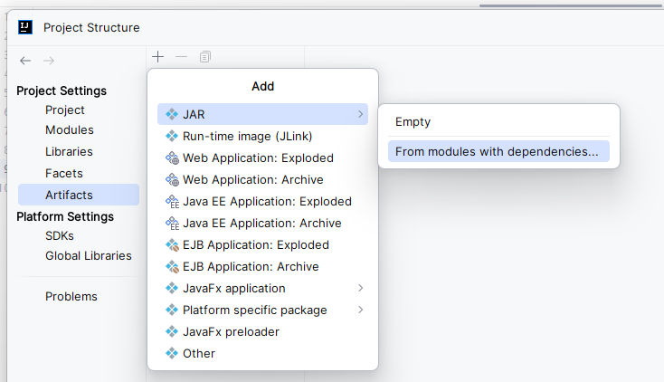

6. Marcar la opción "Copy to de output..." para generar el fichero Manifest. Este fichero se usa para definir datos 
   relativos a la extensión y al paquete. Es un archivo de metadatos llamado MANIFEST. MF y organizado con pares nombre-valor organizado en diferentes secciones.

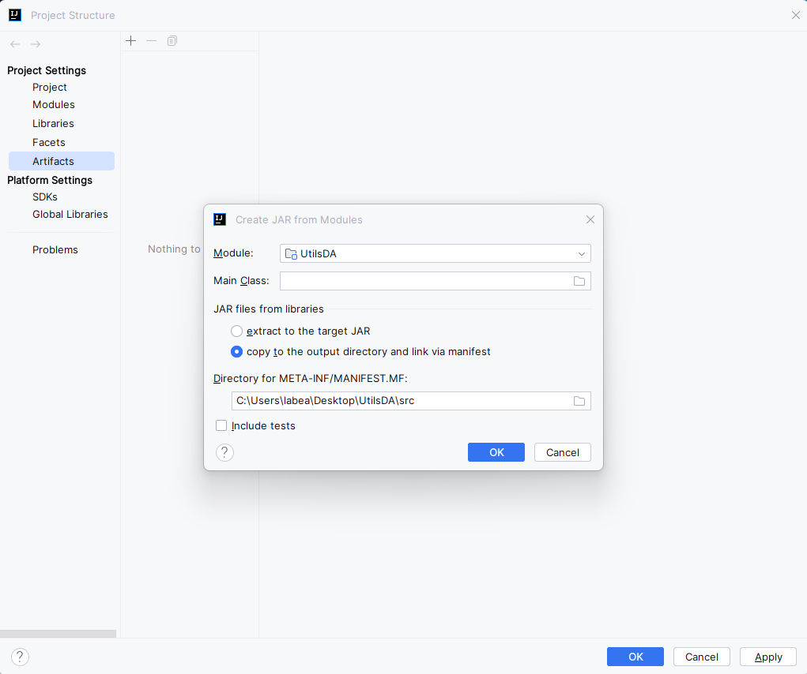

7. Cambiar el output directory para que apunte directamente al de fuentes. Y terminamos.

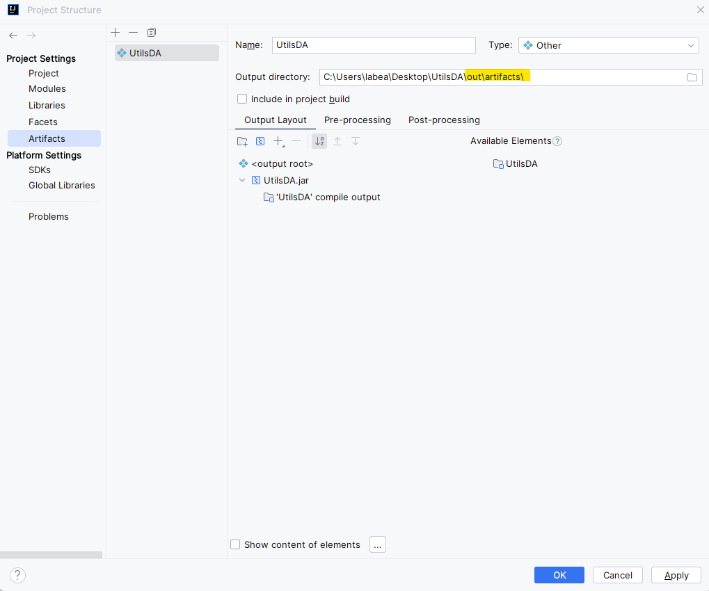

8. Revisemos como se ha añadido correctamente el MANIFEST.MF

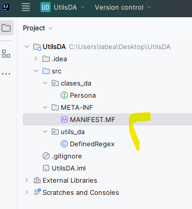

9. A continuación sólo nos queda generar el artefacto para poder usarlo. Para ello vamos al menú principal "Build" y 
   "Build artifacts..."

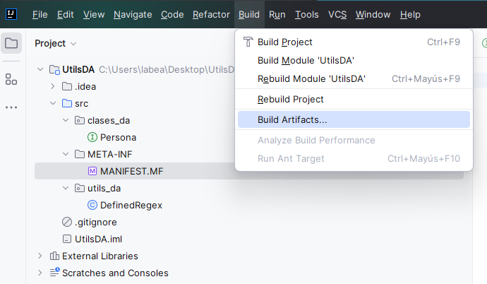

10. En el menú que aparece pinchamos en Build

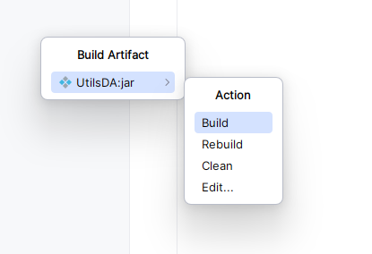

11. Y ya podemos ver el código compilado y el artefacto generado en la ventana del explorador de proyecto.

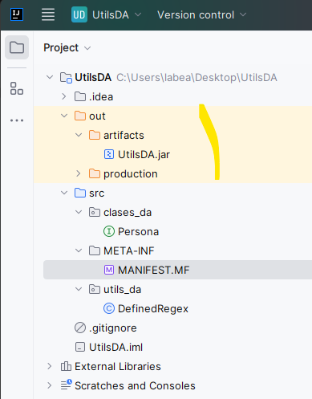

## Cómo importar librerías

Vamos "Setting" --> "Projects structure"
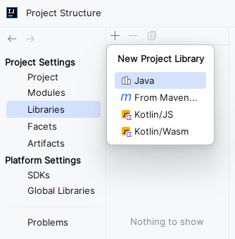
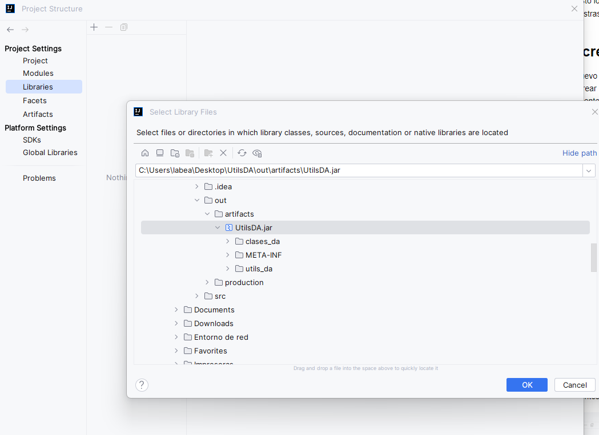
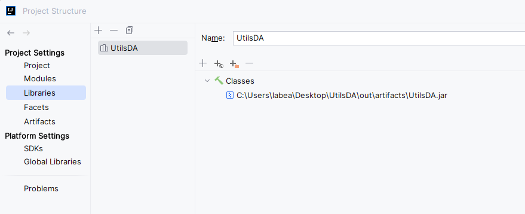
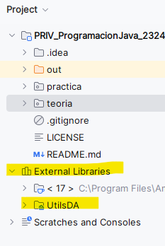
