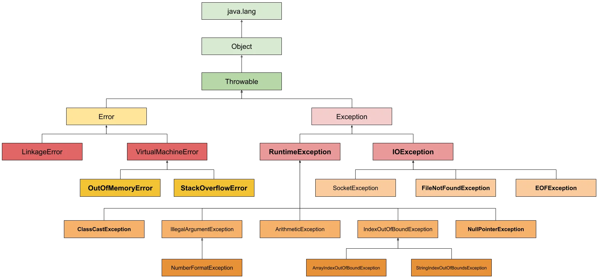

# EXCEPCIONES EN JAVA
<!-- TOC -->
* [EXCEPCIONES EN JAVA](#excepciones-en-java)
* [Introducción a las Excepciones en Java](#introducción-a-las-excepciones-en-java)
* [Diferencia entre `Exception` y `Error` en Java](#diferencia-entre-exception-y-error-en-java)
  * [`Exception`](#exception)
    * [Excepciones Verificadas](#excepciones-verificadas)
    * [Excepciones No Verificadas](#excepciones-no-verificadas)
      * [Ejemplos de excepciones VERIFICADAS](#ejemplos-de-excepciones-verificadas)
        * [1. `IOException`](#1-ioexception)
        * [2. `SQLException`](#2-sqlexception)
        * [3. `ParseException`](#3-parseexception)
        * [4. `ClassNotFoundException`](#4-classnotfoundexception)
      * [Ejemplos de excepciones NO VERIFICADAS](#ejemplos-de-excepciones-no-verificadas)
        * [1. `NullPointerException`](#1-nullpointerexception)
        * [2. `ArrayIndexOutOfBoundsException`](#2-arrayindexoutofboundsexception)
        * [3. `ArithmeticException`](#3-arithmeticexception)
        * [4. `ClassCastException`](#4-classcastexception)
        * [5. `NumberFormatException`](#5-numberformatexception)
  * [`Error`](#error)
  * [Árbol que muestra la jerarquía Excepciones y Errores en Java](#árbol-que-muestra-la-jerarquía-excepciones-y-errores-en-java)
<!-- TOC -->

# Introducción a las Excepciones en Java

Para ver esta información de forma más amena podéis acceder a [AULA EN LA NUBE](https://www.youtube.com/watch?v=lWC9rt0vBek&list=PLG1qdjD__qH6ULjW5iN8E45m5nkaCNbUu&index=133&t=52s)

Las excepciones en Java son eventos que ocurren durante la ejecución de un programa y que pueden interrumpir el flujo normal de instrucciones. Estas proporcionan un mecanismo para manejar situaciones de error de manera controlada.

Cuando se produce una excepción, Java crea un objeto de tipo Exception y lo lanza. A partir de ahí el programa pede 
manejar la situación de maneras 
diferentes:
- No hacer nada
- Capturar la excepción
- Lanzarla y propagarla

# Diferencia entre `Exception` y `Error` en Java

En Java, tanto `Exception` como `Error` son subclases de la clase `Throwable`, pero tienen propósitos y situaciones de uso diferentes.

## `Exception`

Las `Exception` son eventos no deseados o excepcionales que pueden ocurrir durante la ejecución de un programa. Representan situaciones que el programa puede anticipar y manejar para evitar que el programa se detenga abruptamente. Las `Exception` pueden ser verificadas o no verificadas.

### Excepciones Verificadas

Son aquellas que el compilador __obliga a manejar o declarar__. Estas excepciones extienden directamente de la clase 
`Exception` pero no de `RuntimeException`. Deben ser manejadas utilizando bloques `try-catch` o declaradas en la firma del método con la palabra clave `throws`.

Es importante manejar estas excepciones adecuadamente para construir aplicaciones más robustas y prevenir posibles errores durante la ejecución.

### Excepciones No Verificadas

Son aquellas que el compilador no obliga a manejar ni declarar. Estas excepciones extienden de la clase `RuntimeException`. Generalmente, se deben a errores en la lógica del programa y el compilador 
no obliga a manejarlas, ya que, en la mayoría de los casos, deben ser manejadas mediante la corrección de dicho código.

#### Ejemplos de excepciones VERIFICADAS

##### 1. `IOException`

Se lanza cuando ocurre un error de entrada/salida, por ejemplo, al trabajar con archivos.

```java
import java.io.BufferedReader;
import java.io.FileReader;
import java.io.IOException;

public class IOExceptionExample {
    public static void main(String[] args) {
        try {
            BufferedReader reader = new BufferedReader(new FileReader("archivo.txt"));
            String linea = reader.readLine(); // Esto lanzará IOException si hay un problema al leer el archivo.
        } catch (IOException e) {
            e.printStackTrace();
        }
    }
}
```

##### 2. `SQLException`

Ocurre en situaciones relacionadas con bases de datos, como problemas de conexión o ejecución de consultas.

```java
import java.sql.Connection;
import java.sql.DriverManager;
import java.sql.PreparedStatement;
import java.sql.SQLException;

public class SQLExceptionExample {
    public static void main(String[] args) {
        try {
            Connection connection = DriverManager.getConnection("url", "usuario", "contraseña");
            PreparedStatement statement = connection.prepareStatement("SELECT * FROM tabla");
            statement.executeQuery(); // Esto lanzará SQLException si hay un problema en la consulta.
        } catch (SQLException e) {
            e.printStackTrace();
        }
    }
}
```

##### 3. `ParseException`

Se lanza cuando ocurre un error al analizar una cadena en un formato específico, como fechas.

```java
import java.text.ParseException;
import java.text.SimpleDateFormat;
import java.util.Date;

public class ParseExceptionExample {
    public static void main(String[] args) {
        try {
            String fechaStr = "01/01/2022";
            SimpleDateFormat formato = new SimpleDateFormat("dd/MM/yyyy");
            Date fecha = formato.parse(fechaStr); // Esto lanzará ParseException si la cadena no se puede analizar.
        } catch (ParseException e) {
            e.printStackTrace();
        }
    }
}
```

##### 4. `ClassNotFoundException`

Se lanza cuando se intenta cargar una clase que no se encuentra en tiempo de ejecución.

```java
public class ClassNotFoundExceptionExample {
    public static void main(String[] args) {
        try {
            Class.forName("ClaseNoExistente"); // Esto lanzará ClassNotFoundException.
        } catch (ClassNotFoundException e) {
            e.printStackTrace();
        }
    }
}
```


#### Ejemplos de excepciones NO VERIFICADAS

##### 1. `NullPointerException`

Se produce cuando se intenta acceder a un objeto que no ha sido inicializado.

```java
public class NullPointerExceptionExample {
    public static void main(String[] args) {
        String str = null;
        System.out.println(str.length()); // Esto lanzará NullPointerException
    }
}
```

##### 2. `ArrayIndexOutOfBoundsException`

Ocurre cuando se intenta acceder a un índice fuera del rango permitido en un array.

```java
public class ArrayIndexOutOfBoundsExceptionExample {
    public static void main(String[] args) {
        int[] array = new int[5];
        System.out.println(array[10]); // Esto lanzará ArrayIndexOutOfBoundsException
    }
}
```

##### 3. `ArithmeticException`

Se produce en operaciones aritméticas cuando se intenta realizar una operación no válida, como la división entre cero.

```java
public class ArithmeticExceptionExample {
    public static void main(String[] args) {
        int result = 10 / 0; // Esto lanzará ArithmeticException
    }
}
```

##### 4. `ClassCastException`

Ocurre cuando se intenta realizar una conversión de tipos no válida.

```java
public class ClassCastExceptionExample {
    public static void main(String[] args) {
        Object obj = "Hola";
        Integer num = (Integer) obj; // Esto lanzará ClassCastException
    }
}
```

##### 5. `NumberFormatException`

Se lanza cuando se intenta convertir una cadena a un tipo numérico, pero la cadena no tiene un formato numérico válido.

```java
public class NumberFormatExceptionExample {
    public static void main(String[] args) {
        String str = "abc";
        int num = Integer.parseInt(str); // Esto lanzará NumberFormatException
    }
}
```

## `Error`

Los `Error` son situaciones excepcionales que generalmente están fuera del control del programador y que indican problemas graves en la máquina virtual de Java (JVM) o en el entorno de ejecución. A diferencia de las `Exception`, los `Error` no deberían manejarse ni recuperarse, ya que representan condiciones que normalmente indican un estado irrecuperable.

- **Ejemplos de Errors:**
    - `OutOfMemoryError`: Indica que la JVM se ha quedado sin memoria.
    - `StackOverflowError`: Indica un desbordamiento de pila.
    - `LinkageError`: Indica un problema con la vinculación de clases.

## Árbol que muestra la jerarquía Excepciones y Errores en Java

