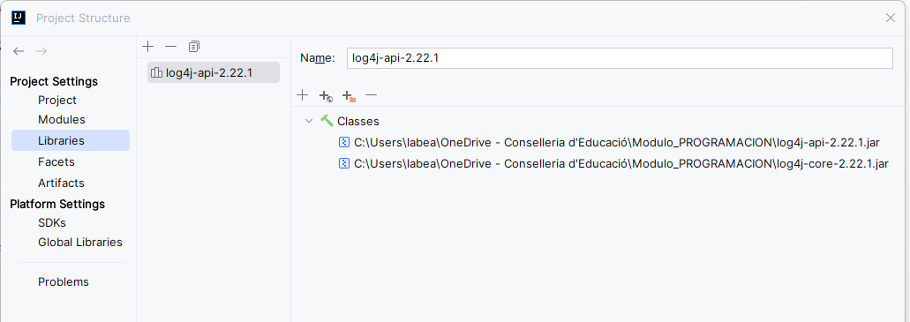
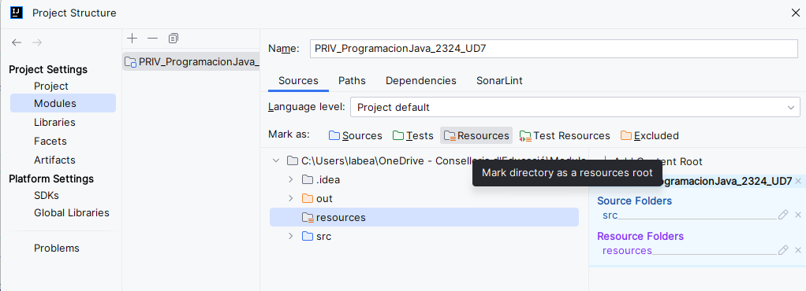

# LOGANDO EN JAVA

El registro de logs es un aspecto indispensable del proceso de desarrollo de software. 
Permite a los desarrolladores monitorear y solucionar problemas de aplicaciones de manera efectiva mediante la 
recopilación y el análisis de datos. Al identificar posibles problemas y errores, el logado desempeña un papel 
fundamental a la hora de mejorar la calidad del código y optimizar el rendimiento.

Existen diferentes frameworks de registro de logs para Java. Por ejemplo el paquete `java.util.logging` es una 
funcionalidad de logado incluida en el lenguaje, pero ofrece funciones de registro muy básicas.

Aquí vamos a ver por encima el funcionamiento del framework __log4j__, que nos ofrece un marco de trabajo más potente y 
flexible. 

## LOG4J

### Puesta en marcha

#### Descargar y cargar librerías necesarias

Vamos a descargarlas de este proyecto, en la carpeta `externalLibraries`:

    log4j-api-2.22.1.jar
    log4j-core-2.22.1.jar

Estas dos se han extraído del [repositorio central de Maven](https://mvnrepository.com/).

Lo habitual más adelante será utilizar alguna herramienta de gestión de dependencias en nuestro proyecto, como por 
ejemplo Maven, pero para no añadir más complejidad, de momento vamos a hacerlo así.

Lo siguiente será ir a las propiedades de nuestro proyecto e incorporar estos dos nuevos jar a nuestras librerías 
del proyecto.



#### Configuración

Ahora vamos a ver como utilizarlo. Para ello creamos una carpeta `resources` en nuestro proyecto y en las propiedades 
del proyecto, configuramos esta nueva carpeta como carpeta de recursos.



Ahora, dentro de esta carpeta creamos un fichero con el nombre log4j2.xml con el contenido siguiente:

```xml
<?xml version="1.0" encoding="UTF-8"?>
<Configuration status="INFO">
    <Appenders>
        <Console name="LogToConsole" target="SYSTEM_OUT">
            <PatternLayout pattern="%d{HH:mm:ss.SSS} [%t] %-5level %logger{36} - %msg%n"/>
        </Console>
        <File name="LogToFile" fileName="app.log">
            <PatternLayout>
                <Pattern>%d %p %c{1.} [%t] %m%n</Pattern>
            </PatternLayout>
        </File>
    </Appenders>
    <Loggers>
        <Root level="info">
            <AppenderRef ref="LogToFile"/>
            <AppenderRef ref="LogToConsole"/>
        </Root>
    </Loggers>
</Configuration>
```

#### Uso

Ahora solo nos queda usarlo en nuestro proyecto y para ello, solo tenemos que hacer dos pasos:

1. Declarar el logger
2. Usarlo

```java
public class MiClase {
    
    private static Logger LOGGER = LogManager.getRootLogger();
    
    public static void main(String[] args) {
       
        try {
            // Código que puede generar una excepción
        } catch (ArithmeticException e) {
            LOGGER.error("¡Error aritmético! No se puede dividir por cero.");
        }
        
```

### Detalles de configuración

El archivo de configuración que hemos creado, `log4j2.xml` , es esencial para la configuración del sistema de 
registro de Log4j en una aplicación Java. Permite personalizar diversos aspectos del registro, como los niveles de 
registro, el formato de los mensajes, los destinos de salida, entre otros.

Hay muchas formas de crear la configuración de Log4j2 en nuestra aplicación: usando un archivo de configuración 
escrito en XML, JSON, YAML o archivo de propiedades y de forma programática. 
Aunque quizá su configuración a través de un xml sea la forma más rudimentaria, se considera la más sencilla de 
comprender en este momento debido a que se trabaja paralelamente en la asignatura de "lenguajes de marcas".

Vamos a ver sin entrar en mucha profundidad, las propiedades más comunes que puedes configurar en un archivo `log4j2.
xml`:

```xml
<?xml version="1.0" encoding="UTF-8"?>

<!-- Configuration: Este es el elemento raíz del archivo y puede contener atributos como `status` para configurar el 
nivel de registro del sistema de registro de Log4j -->
<Configuration status="INFO">
   
   <!-- Los appenders son los destinos de salida donde se enviarán los mensajes de registro. Puedes 
   configurar appenders para escribir en archivos, consola, bases de datos, entre otros. Algunos de los appenders 
   comunes son `ConsoleAppender`, `FileAppender`, `RollingFileAppender`, `SyslogAppender`, etc. -->
    <Appenders>
       
       <!-- Aquí usamos un appender que escribe por consola -->
        <Console name="LogToConsole" target="SYSTEM_OUT">
           <!-- PatternLayout: Aquí puedes especificar cómo se formateará el mensaje de registro: fecha, categoría, 
           el nivel de registro, mensaje... Puedes personalizar el diseño utilizando patrones como 
           `%d` para la fecha, `%p` para el nivel de registro, `%c` para la categoría, `%m` para el mensaje, etc. -->
            <PatternLayout pattern="%d{HH:mm:ss.SSS} [%t] %-5level %logger{36} - %msg%n"/>
        </Console>

       <!-- Aquí usamos un appender que escribe en el archivo app.log -->
        <File name="LogToFile" fileName="app.log">
            <PatternLayout>
                <Pattern>%d %p %c{1.} [%t] %m%n</Pattern>
            </PatternLayout>
        </File>
    </Appenders>
   
   <!-- Loggers: puede contener configuraciones de los niveles de registro para diferentes categorías o paquetes 
   en tu aplicación. Puedes definir múltiples elementos <Logger> dentro de <Loggers>, cada uno con un atributo name que especifica la categoría o paquete al que se aplica la configuración del nivel de registro. -->
    <Loggers>
       
       <!-- La definición del logger root le dice a Log4j que use esa configuración cuando no se encuentre una 
       configuración dedicada -->
        <Root level="info">
            <AppenderRef ref="LogToFile"/>
            <AppenderRef ref="LogToConsole"/>
        </Root>
       
       <!-- En el caso de estos dos loggers cada uno de ellos especificado para un paquete de mi código diferente -->
       <Logger name="teoria.demo_logger" level="error">
          <AppenderRef ref="LogToConsole"/>
       </Logger>
       <Logger name="practica.solucion_ejercicios" level="debug">
          <AppenderRef ref="LogToFile"/>
       </Logger>
    </Loggers>
</Configuration>
```
Por último, cuando declaramos la instancia de Logger en nuestro código, tenemos dos opciones principales:

    private static Logger LOGGER = LogManager.getRootLogger();

    private static Logger LOGGER = LogManager.getLogger("teoria.demo_logger");


[Vamos a hacer pruebas con una división entre cero](demo_logger/Division.java)

- Logar solo con ROOT en debug y luego solo con root en Error a ver que diferencia hay
- Añadir logers comentados y ver si pasa algo
- Cambiar de loggar por defecto con ROOT a hacerlo con un Logger concreto.
